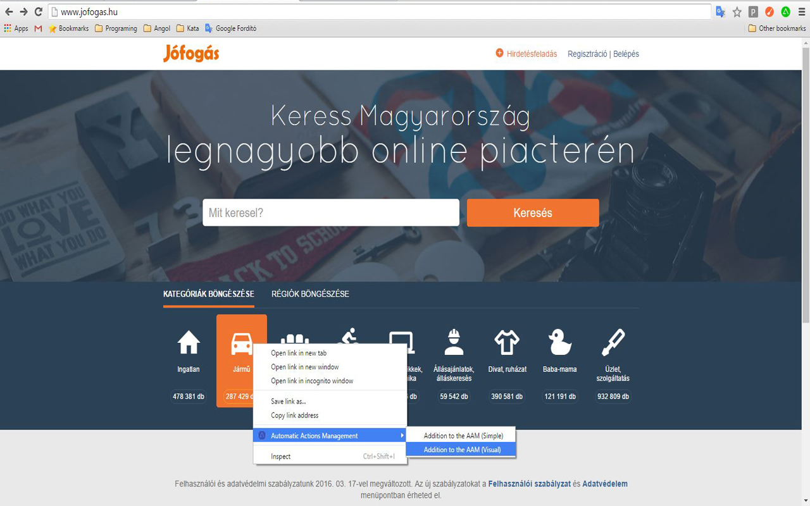

# Automatic Actions Management
This chrome extension will able to run predefined user events.

Version
----

1.0.5

Example usage
----

Cookie accepter:

	- Open the website where you wish to use AAM
	- Click right mouse button on the acceptor of the cookies.
	- Select 'Addition to the AAM (Simple)' item from context menu list.

   

	- The extension has created the 'Action' in the background with default settings.
  	- if you want to view or to modify the settings, click on AAM icon on top right corner of the browser. 
      When popup window opens, click AAM setting button.
	- Settings tab opens.

   

Settings tab table columns:

    - Target URL: it is a target website url where you want to activate AAM
   	- Selector Or Script: selected item full DOM path Or script Filename*
   	- Document state: That status of the document, when you want to launch AAM (Dom content loaded or window loaded)
   	- Event type: click, remove or script (inject)
   	- Repeat: repeat count
   	- Timeout (ms): repeat timeouts
   	- On-Off: enable, disable
   	- Remove: delete row
   	
*created automatically if selected event is injected and clicked into 'Selector Or Script' named cell.

   

      - Script inject mode

   

Special Visual selection:

	- Open the website where you wish to use AAM
	- Click right mouse button on the acceptor of the cookies.
	- Select 'Addition to the AAM (Visual)' item from context menu list.

   

Hold right ALT Key and press:

	- w: select parent
	- s: select first children
	- d: select next sibling
	- a: select prev sibling
	- e: add to AAM
	- q: quit

   

License
----

MIT

Author: Tóth András
---
http://atandrastoth.co.uk/

2016-03-16
