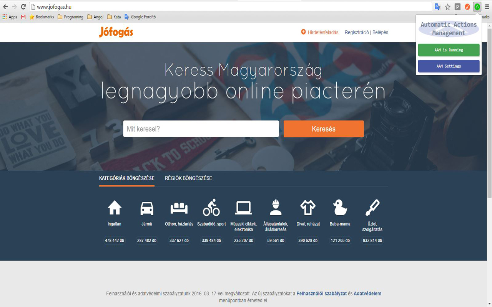
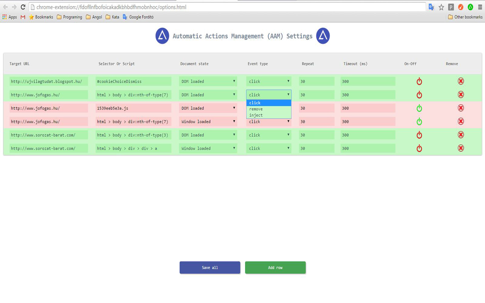

# Automatic Actions Management
This chrome extension will able to run predefined user events.

Version
----

1.0.0

   - Detailed description coming soon...

#

#

#

#

#

License
----

MIT

Author: Tóth András
---
http://atandrastoth.co.uk/

2016-03-16
